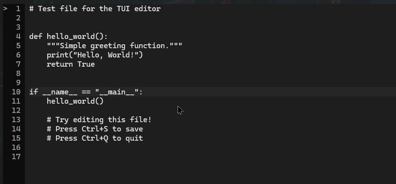

# Textual Code Editor

Простой TUI редактор кода на Python с подсветкой синтаксиса.



## Установка

```bash
pip install -r requirements.txt
```

## Использование

```bash
# Открыть существующий файл
python editor.py path/to/file.py

# Открыть пустой редактор
python editor.py
```

## Горячие клавиши

| Клавиша | Действие |
|---------|----------|
| `Ctrl+S` | Сохранить файл |
| `Ctrl+Q` | Выйти из редактора |
| `Ctrl+Z` | Отменить (Undo) |
| `Ctrl+Y` | Повторить (Redo) |
| `Ctrl+F` | Поиск |
| `Ctrl+O` | Открыть файл |
| `↑ ↓ ← →` | Навигация |
| `Home/End` | Начало/конец строки |
| `Page Up/Down` | Прокрутка страницы |

## Возможности

- ✅ Открытие файлов через аргументы CLI или диалог (Ctrl+O)
- ✅ Сохранение файлов (Ctrl+S)
- ✅ Автоопределение языка по расширению файла (Python, JavaScript, Rust, Go, и др.)
- ✅ Номера строк с указателем текущей строки (`>`)
- ✅ Статус-бар с информацией о файле
- ✅ Индикация несохранённых изменений `[●]`
- ✅ Undo/Redo (Ctrl+Z/Y)
- ✅ Поиск по тексту (Ctrl+F)
- ✅ Поддержка 300+ языков через Pygments

## Примеры

```bash
# Редактировать Python файл
python editor.py main.py

# Редактировать JavaScript
python editor.py script.js

# Редактировать Rust
python editor.py src/main.rs

# Создать новый файл
python editor.py newfile.txt
```

## Список поддерживаемых языков

- Python (.py)
- JavaScript/TypeScript (.js, .ts, .jsx, .tsx)
- HTML/CSS (.html, .htm, .css, .scss, .sass)
- Rust (.rs)
- Go (.go)
- C/C++ (.c, .h, .cpp, .hpp)
- Java (.java)
- Kotlin (.kt)
- Swift (.swift)
- Ruby (.rb)
- PHP (.php)
- Bash (.sh, .bash, .zsh)
- PowerShell (.ps1)
- JSON (.json)
- XML (.xml)
- YAML (.yaml, .yml)
- TOML (.toml)
- Markdown (.md)
- SQL (.sql)
- Dockerfile
- И многие другие...

## Требования

- Python 3.8+
- Textual 0.44+
- Pygments 2.16+

## Лицензия

MIT
